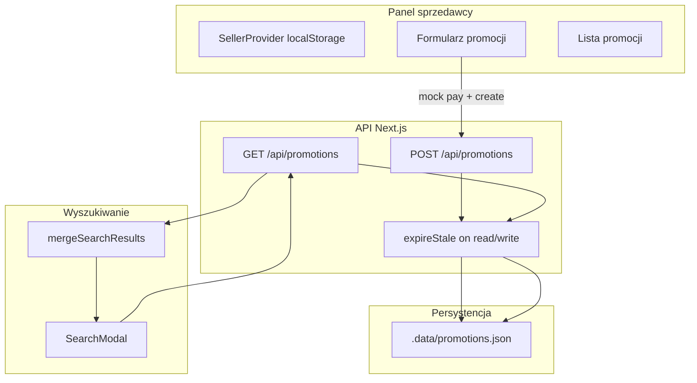

# Plan: Promoted Listings MVP

## Kontekst

Repozytorium to frontowy szablon marketplace ([`TARGET.md`](TARGET.md) wyklucza prawdziwy backend). Istnieją już `Product.sellerId`, [`getProductsBySeller`](src/data/products.ts) i modal [`SearchModal`](src/components/search-modal.tsx) (filtrowanie po `name`, limit 6 wyników, bez sortowania). **Brak** panelu sprzedawcy, API routes i mechanizmu promocji.

Wybrane przez Ciebie założenia:
- **Persystencja:** Route Handlers Next.js + plik JSON (demo), mock płatności
- **Powierzchnia:** rozszerzony modal w headerze (bez `/search`)

---

## Architektura



### Model danych

Nowy typ w [`src/types/promotion.ts`](src/types/promotion.ts):

```ts
export interface ListingPromotion {
  id: string;
  productId: string;
  sellerId: string;
  status: "active" | "expired";
  weeklyFeePln: 49;
  createdAt: string;   // ISO
  startsAt: string;      // ISO (= createdAt po płatności)
  endsAt: string;        // startsAt + 7 dni
}
```

**Reguły biznesowe (serwer):**
| Reguła | Implementacja |
|--------|----------------|
| Max 3 aktywne promocje globalnie | `countActive() >= 3` → HTTP **409**, body: `"Wszystkie sloty promowane są zajęte"` |
| Produkt należy do sprzedawcy | `product.sellerId === sellerId` z sesji/request body |
| Brak duplikatu aktywnej promocji tego produktu | odrzucenie jeśli ten `productId` już ma `status: active` |
| Wygaśnięcie po 7 dniach | przy każdym GET/POST: `endsAt < now` → `status: expired` |
| Mock płatność | jeden POST z `{ sellerId, productId, confirmPayment: true }` — bez Stripe |

**Wyniki wyszukiwania (klient):**
1. Pobierz aktywne promocje (`GET /api/promotions?status=active`).
2. Zmapuj na produkty pasujące do `query` (to samo `name.includes` co dziś).
3. **Promowane:** max 3 na górze listy, etykieta „Promowane”.
4. **Organiczne:** pozostałe dopasowania, **bez** ID już pokazanych w promowanych.
5. Wizualny separator: sekcja + `border-t` / nagłówek między blokami (nie tylko badge na karcie).

Globalny limit 3 slotów dotyczy **zakupu** promocji; w modalu przy danym zapytaniu może być 0–3 promowane wiersze (tylko te pasujące do frazy).

---

## Warstwa serwera

### Pliki

| Plik | Odpowiedzialność |
|------|------------------|
| [`src/lib/promotions/store.ts`](src/lib/promotions/store.ts) | Odczyt/zapis `.data/promotions.json`, `fs` + `crypto.randomUUID()` |
| [`src/lib/promotions/service.ts`](src/lib/promotions/service.ts) | `expireStale`, `listActive`, `createPromotion`, walidacje |
| [`src/app/api/promotions/route.ts`](src/app/api/promotions/route.ts) | `GET` (opcjonalnie `?sellerId=`), `POST` (tworzenie po mock pay) |

Dodać `.data/` do [`.gitignore`](.gitignore); opcjonalnie [`data/promotions.seed.json`](data/promotions.seed.json) jako przykład dla dev (nie commitować aktywnego stanu).

### Przykładowa sygnatura POST

```ts
// Request
{ sellerId: string; productId: string; confirmPayment: true }

// Success 201
{ promotion: ListingPromotion }

// 409 — wszystkie sloty zajęte
{ error: "Wszystkie sloty promowane są zajęte" }
```

---

## Panel sprzedawcy (nowe trasy)

| Trasa | Cel |
|-------|-----|
| [`src/app/seller/login/page.tsx`](src/app/seller/login/page.tsx) | Wybór sprzedawcy z [`sellers`](src/data/sellers.ts) (mock login, wzorzec jak [`auth-provider.tsx`](src/components/auth-provider.tsx)) |
| [`src/app/seller/promotions/page.tsx`](src/app/seller/promotions/page.tsx) | Lista promocji sprzedawcy + CTA „Promuj produkt” |
| [`src/app/seller/promotions/new/page.tsx`](src/app/seller/promotions/new/page.tsx) | Formularz: select produktu (`getProductsBySeller`), podsumowanie **49 PLN / tydzień**, przycisk „Opłać i promuj” |

Komponenty:
- [`src/components/seller-provider.tsx`](src/components/seller-provider.tsx) — `sellerId` w `localStorage`, guard na trasach `/seller/*`
- [`src/components/seller/promotion-form.tsx`](src/components/seller/promotion-form.tsx) — obsługa błędu 409 (komunikat po polsku)
- [`src/components/seller/promotion-list.tsx`](src/components/seller/promotion-list.tsx) — status, data końca, produkt

Dodać link w [`header.tsx`](src/components/header.tsx) (np. „Panel sprzedawcy”) — tylko gdy zalogowany seller lub zawsze widoczny dla demo.

Opakować `SellerProvider` w [`src/app/layout.tsx`](src/app/layout.tsx) obok `AuthProvider`.

---

## Modal wyszukiwania

Zmiany w [`src/components/search-modal.tsx`](src/components/search-modal.tsx):

1. `useEffect` / `SWR` — fetch `GET /api/promotions` przy otwarciu modala (cache w stanie komponentu).
2. Wydzielić logikę do [`src/lib/promotions/merge-search-results.ts`](src/lib/promotions/merge-search-results.ts) (czysta funkcja, łatwe testy):

```ts
mergeSearchResults(products, activePromotions, query): {
  promoted: Product[];
  organic: Product[];
}
```

3. UI wyników:
   - Sekcja **Promowane** (0–3 wiersze) — badge „Promowane” (np. `bg-charcoal text-white`, odróbny od badge `NEW`/`SALE` w [`product-card.tsx`](src/components/product-card.tsx))
   - Separator wizualny
   - Sekcja wyników organicznych (zwiększyć limit np. do 12–20 + scroll w panelu, żeby promowane nie „zjadały” całego modala)
4. Zachować nawigację `Link` → `/products/[slug]` i zamykanie modala po kliknięciu.

Opcjonalnie: wspólny wiersz [`src/components/search-result-row.tsx`](src/components/search-result-row.tsx) z propem `variant: "promoted" | "organic"` — uniknięcie duplikacji JSX z obecnego mapowania.

---

## Teksty UI (PL)

- Etykieta: **Promowane**
- Błąd slotów: **Wszystkie sloty promowane są zajęte**
- Formularz: „Wybierz produkt”, „Opłata: 49 PLN / tydzień”, „Opłać i promuj”
- Lista: „Aktywna do {data}”, „Wygasła”

---

## Testowanie ręczne (acceptance)

1. Zaloguj się jako sprzedawca A → promuj produkt X → mock pay → sukces.
2. Powtórz dla sprzedawców B i C (3 aktywne globalnie).
3. Sprzedawca D → próba 4. promocji → komunikat o zajętych slotach.
4. Wyszukaj frazę pasującą do X → pozycje 1–3 (lub mniej jeśli mniej pasuje), badge „Promowane”, separator, potem organiczne.
5. Ustaw w seedzie / ręcznie w JSON `endsAt` w przeszłości → po odświeżeniu API produkt znika z promowanych; w panelu status „Wygasła”.
6. `npm run build` + `npm run lint` — brak błędów TypeScript.

---

## Poza zakresem (zgodnie ze spec)

- CPC / aukcje
- Panel admin FashionHero
- Analytics skuteczności
- Stripe / prawdziwe płatności
- Strona `/search` i promocje na PLP [`collection-view.tsx`](src/components/collection-view.tsx)

---

## Kolejność implementacji

1. Typy + store JSON + service + expire logic  
2. `GET/POST /api/promotions` + testy ręczne przez `curl`  
3. `SellerProvider` + trasy panelu + formularz z obsługą 409  
4. `merge-search-results` + przebudowa `SearchModal`  
5. Lint/build + doprecyzowanie copy PL i link w headerze
